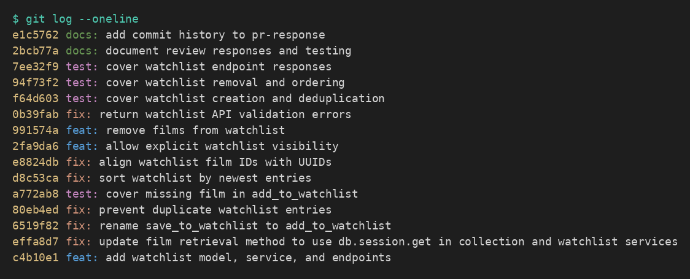

# PR Response Doc — CineLog Watchlist Feature

## AI Usage

I used Codex throughout this review cycle for repository orientation, locating the
six canonical review comments, comparing the watchlist implementation with the
existing collection patterns, implementing changes, and checking Git history.
Codex also acted as a devil's advocate for Comments 4 and 5: it challenged the
privacy implications of a public default and the discoverability tradeoff of a
recency-based sort. That review led me to keep the positions below narrowly
grounded in CineLog's current code rather than claiming that social features
already exist. Every implementation claim in this document was checked against
the final diff and the automated test suite.

## Comment 1 — Rename

**What I did:** Renamed `save_to_watchlist()` to `add_to_watchlist()` in
`services/watchlist_service.py` and updated the import and call in
`routes/watchlist/watchlist.py`. This follows the `verb_to_noun` convention used
by `add_to_collection()` and `remove_from_collection()`.

**How I verified:** Searched every Python file for both names with `rg` and
confirmed that no `save_to_watchlist` reference remains. The full test suite also
imports and calls the renamed function successfully.

## Comment 2 — Deduplication

**What I did:** Added `AlreadyInWatchlistError` and a service-level lookup for an
existing `(user_id, film_id)` pair before inserting. I also added a database
unique constraint for the same pair. The service check gives callers a useful
domain error, while the constraint protects the invariant if another code path
inserts directly. The route maps the domain error to HTTP `409 Conflict`.

**How I verified:** `test_add_to_watchlist_duplicate_raises` adds the same film
twice, asserts the expected exception, and confirms that only one row exists.
`test_add_watchlist_endpoint_maps_validation_errors` separately verifies the
endpoint returns 409.

## Comment 3 — Missing test

**What I did:** Added
`test_add_to_watchlist_nonexistent_film_raises`, modeled on the equivalent
collection-service test. It uses a syntactically valid UUID that is absent from
the test database and asserts `FilmNotFoundError`.

**How I verified:** Ran `pytest tests/test_watchlist.py -v` in isolation and then
ran the complete `pytest tests/ -v` suite.

## Comment 4 — Default visibility

**My position:** Keep `public=True` as the default, while allowing callers to
make an explicit visibility choice.

**Reasoning:** CineLog describes itself as a community film tracker, so a public
default leaves room for future discovery features and makes shared watchlists
possible without migrating existing rows later. This is a forward-looking
product choice, not a claim that CineLog already has feeds, followers, or public
profile browsing. The stretch implementation now accepts a `public` boolean in
the POST body, passes it through the service, and persists it, so clients are not
forced to rely on the default.

**Tradeoff acknowledged:** A watchlist exposes intent—what someone plans to
watch—which may feel more private than a record of completed films. A public
default can surprise users if the interface does not disclose it. Before public
profile or discovery features ship, the UI should clearly show visibility and
offer a private choice at creation time. If CineLog cannot provide that informed
choice, privacy-by-default would be the safer policy.

## Comment 5 — Sort order

**My position:** I agree with the maintainer and changed the default to
`date_added` descending (newest first).

**Reasoning:** A watchlist is an active queue of discoveries. Recent additions
are usually the strongest candidates when a user returns to decide what to watch
next. Newest-first also matches `get_collection()`, giving both list features a
predictable default based on their entry timestamp.

**Engagement with reviewer's point:** The maintainer's recency argument fits the
primary queue workflow, but alphabetical order is objectively better when a user
wants to locate a known title, and older entries can sink as the list grows. A
future API could expose selectable sorting or search. Until that exists,
newest-first is the more useful default, and
`test_get_watchlist_returns_newest_first` locks that decision in.

## Comment 6 — Rebase

**What conflicted:** The feature branch began before `main` migrated `Film.id`
and `CollectionEntry.film_id` from integers to UUID strings. Rebasing onto
`main` produced a content conflict in `models.py` when the watchlist changes were
replayed: the feature-side `WatchlistEntry.film_id` was an integer while the
updated `Film.id` was `String(36)`.

**How I resolved it:** Preserved `main`'s UUID-based `Film` and
`CollectionEntry` definitions, restored `WatchlistEntry` with a `String(36)`
foreign key, and added the user/film relationships needed by
`get_watchlist()`. I also changed the service and route documentation from
integer IDs to UUIDs and replaced the integer fake ID in the missing-film test
with a UUID string.

**How I verified no conflict remains:** Searched the watchlist model, service,
route, and tests for integer film-ID assumptions; ran all tests; checked
`git diff --check`; and verified the feature-only history is linear with no merge
commits.

## Commit History

Final `git log --oneline` on `feature/watchlist` after the interactive rebase —
14 commits in conventional format with no merge commits:

```
2bcb77a docs: document review responses and testing
7ee32f9 test: cover watchlist endpoint responses
94f73f2 test: cover watchlist removal and ordering
f64d603 test: cover watchlist creation and deduplication
0b39fab fix: return watchlist API validation errors
991574a feat: remove films from watchlist
2fa9da6 feat: allow explicit watchlist visibility
e8824db fix: align watchlist film IDs with UUIDs
d8c53ca fix: sort watchlist by newest entries
a772ab8 test: cover missing film in add_to_watchlist
80eb4ed fix: prevent duplicate watchlist entries
6519f82 fix: rename save_to_watchlist to add_to_watchlist
effa8d7 fix: update film retrieval method to use db.session.get in collection and watchlist services
c4b10e1 feat: add watchlist model, service, and endpoints
```

Screenshot of the same output:



<!-- TODO: take a screenshot of `git log --oneline` in your terminal, save it as
docs/git-log.png in the repo, then commit it. The image reference above will
render once the file exists. -->

## Stretch Features

### Remove from watchlist

Added `remove_from_watchlist(user_id, film_id)` using the existing
`remove_from_collection()` naming and error pattern. It raises
`NotInWatchlistError` when no matching entry exists. A new
`DELETE /watchlist/<user_id>/remove` endpoint returns 200 on success and 404 for
a missing entry. Tests cover both successful deletion and the missing-entry
case.

### Additional edge-case test

Added `test_get_watchlist_returns_newest_first`. I chose this case because sort
order was a design decision in Comment 5; testing it prevents a future refactor
from silently returning to alphabetical or unspecified database order.

### Visibility toggle

Added an optional `public` argument to `add_to_watchlist()` and the POST
endpoint. An explicit `false` is persisted rather than replaced by the default,
and non-boolean API values return HTTP 400. Endpoint tests verify the private
case end to end.

### Additional fixes found during verification

- Added missing `User.watchlist_entries` and `Film.watchlist_entries`
  relationships so `entry.film` works in `get_watchlist()`.
- Mapped missing-film and duplicate domain errors to HTTP 404 and 409 instead of
  unhandled 500 responses.
- Added endpoint-level tests for visibility, removal, and validation responses.

## PR Description

### What this feature does

Adds watchlists to CineLog so users can save films they intend to watch,
retrieve them newest-first, choose whether each saved entry is public, and
remove entries later. The service rejects missing films and duplicates, and the
REST endpoints return useful validation responses.

### Design decisions

- Watchlists remain public by default to support CineLog's community direction,
  but callers can explicitly opt into private entries.
- Watchlists use newest-first ordering because they act as an active queue of
  recent discoveries. See Comments 4 and 5 above for the full tradeoffs.

### Manual testing

1. Install dependencies and start the API:

   ```bash
   pip install -r requirements.txt
   flask --app app run --debug
   ```

2. In another terminal, create a user and film because the starter app has no
   creation endpoints:

   ```bash
   python -c 'from app import create_app, db; from models import User, Film; app=create_app(); ctx=app.app_context(); ctx.push(); user=User(username="reviewer", email="reviewer@example.com"); film=Film(title="Moonlight", year=2016); db.session.add_all([user, film]); db.session.commit(); print(user.id, film.id)'
   ```

3. Substitute those UUIDs and exercise the API:

   ```bash
   curl -i -X POST http://127.0.0.1:5000/watchlist/USER_ID/add \
     -H 'Content-Type: application/json' \
     -d '{"film_id":"FILM_ID","public":false}'

   curl -i http://127.0.0.1:5000/watchlist/USER_ID

   curl -i -X DELETE http://127.0.0.1:5000/watchlist/USER_ID/remove \
     -H 'Content-Type: application/json' \
     -d '{"film_id":"FILM_ID"}'
   ```

4. Repeat the POST before deleting to confirm it returns 409, and use
   `00000000-0000-0000-0000-000000000000` to confirm a missing film returns
   404.

5. Run the automated suite:

   ```bash
   pytest tests/ -v
   ```
